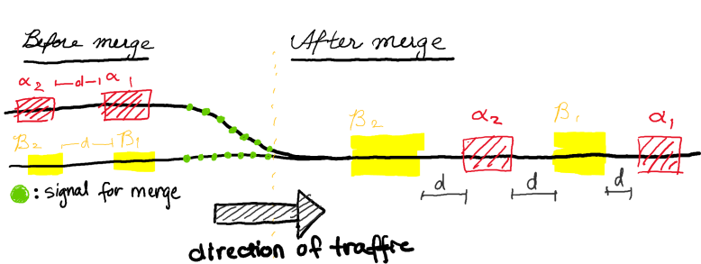

# Platoon Merges and Splits
**UC Berkeley EECS 149 Fall 2021 Final Project Proposal**

**Team**: Lucas Huang, Allen Mao, Andrew Zhang, William Zhang

## Motivation and Goals
Vehicle platooning yield multiple benefits that range from lower fuel consumption (less braking and acceleration since vehicles drive at constant speeds) to greater road efficiency (more efficient traffic flows) [ref][benefits]. These benefits have led to much attention to its implementation especially in the context of autonomous vehicles. Our project therefore focuses on (1) how to interleave (with zipper merge) two platoons of robots and (2) how to split such a platoon.
<!-- 
## Goals
We will implement merging and disengaging on two platoons of robots. In particular, when two platoons meet at a merge, we want the two platoons to merge into a single platoon using zipper merge. We will also implement platoon disengaging where robots can split into two platoons. -->

## Approach
Our system first consists of two single-file platoons that will use darkness sensors to follow a black (duct-taped) line. Each robot will also encode information about which robot is ahead or behind it as a doubly-linked list such that it knows the correct robot to communicate with (via Bluetooth or WiFi). To ensure the constant distance between pairs of robots, our initial plan is to use an ultrasonic sensor to measure distance. Alternative implementions include usage of a central beacon to the status of the cars. We can also use accelerometer, gyroscope, and encoder readings to position the robot kinetically, and compare it to robots before and after it. 

### Video of Concept

https://www.youtube.com/watch?v=Hon3XX8OO88

### Merging
Our system begins with the two single-file platoons of Romi robots, $\alpha$ and $\beta$, that each use the center darkness sensor to follow a straight line (black duct tape). When the platoons approach an intersection, a signaling mechanism (change in color or some other approach, TBD) will alert the platoon that a merge is imminent. 

Once the platoons receive the signal for an upcoming merge, they will send out a signal such that the other platoon will be aware of a merge taking place. Platoon $\beta$'s cars will space out so that platoon $\alpha$'s cars can interleave themselves, as is shown in the diagram below. Cars in platoon $\alpha$ will pull up to the end of their lane, and insert themselves in the appropriate times. The cars in platoon $\alpha$ will know when to insert themselves based on signals sent by platoon $\beta$ when checkpoints are passed. If no more cars in platoon $\beta$ remain, all cars in platoon $\alpha$ will merge automatically. The platoon will send a signal when the last robot of the platoon $\alpha$ exits the junction, denoted by another piece of colored tape at the exit. Finally, all gaps within the now unified platoon will be closed.

<!-- note from will: idk if we need this b elow part, because I think we're only trying to merge 2 platoons? merging more platoons might result in overcomplicating the problem for ourselves -->
If the platoon received a signal during the process that another platoon is trying to merge, it would clear the junction such that any cars that haven't entered would stop. Once the junction has cleared, the platoon would give a signal and yield the right of way. The other platoon is then allowed to let one car go through, send a signal once it's done, and yield the right of way. This would continue until one platoon runs out of cars, and the rest of the platoon would be stacked. Afterwards, one of the platoons would be eliminated, and the entire platoon linked list would be reorganized to contain robots from both platoons.

### Splitting
When given the signal to separate, which should contain which cars would separate, the cars that separates would watch for exits to the right. Once the exit has been spotted, they would remove themselves from the original platoon and form a new platoon. Then, robots in each platoon would close the gap. 

## Resources

- 3 Distance sensors per Romi (ultrasonic sensors under current consideration)
- Duct tape to mark trajectory for Romi to follow.
- 4-5 Romi robots 

## Timeline of Deliverables

- October 31: Project Proposal 
- November 7: Have FSM drawn out, order neccessary parts, start figuring out/exploring Romi code, construct skeleton code needed for project
- November 14: Figure out how to attach and use distance sensors on cars, and find how to use colored tape to detect checkpoints. Find how to send signals from one robot to another. 
- November 21: Figure out how to create set distance gaps between cars within one platoon, and how to have all cars in a platoon to drive up to a certain checkpoint denoted by a piece of colored tape. 
- November 28: Write merging code, start testing
- December 5: Continue testing
- December 12: Conclude testing, write final report, make video

## Risks and Feasibility 

One risk is that we have no guarantee that the romi's will drive straight. <!-- But isn't this the point of PWM control? -->
This project is fully dependent on the fact that the romi's will exhibit consistent movement throughout the demo. 

## Github Link
https://github.com/williamyixin/autonomous_zipper_merge

[benefits]: https://www.acea.auto/fact/what-are-the-benefits-of-truck-platooning/ "What are the benefits of truck platooning?"
